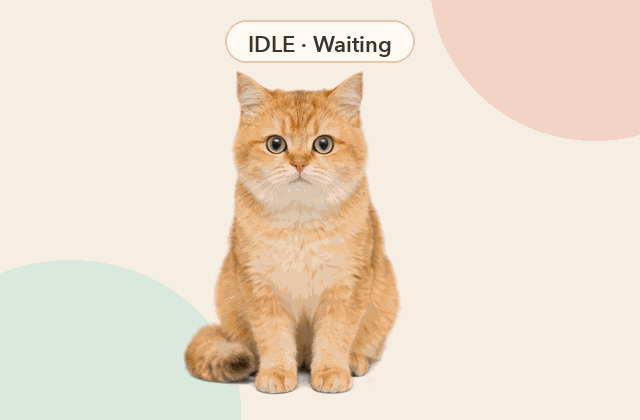
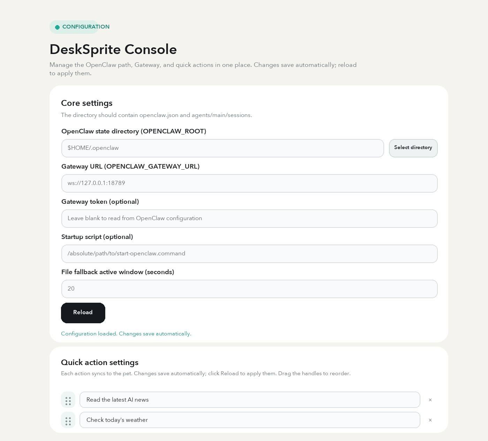
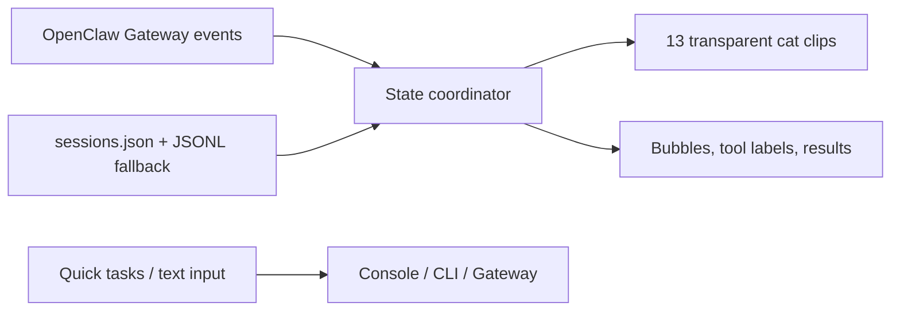

<div align="center">


# 🐈 OpenClaw Desk Pet

<p>
  <strong>English</strong> ·
  <a href="README.md">简体中文</a> ·
  <a href="README.ja.md">日本語</a>
</p>

**Turn AI activity into a cat on your desktop.**

I built this because I was tired of switching back to a console just to check whether OpenClaw was still working. Now a glance at the cat is enough: sitting means idle, standing up means work has started, and holding the phone means it is still busy.

<p>
  <a href="https://github.com/LeoZhaorx/openclaw-desk-pet/actions/workflows/ci.yml"></a>
  
  
  
  <a href="LICENSE"></a>
</p>

<p>
  <a href="#the-cats-workflow">🎬 Demo</a> ·
  <a href="#why-choose-a-cat-as-your-desktop-companion">💡 Story</a> ·
  <a href="#how-openclaw-and-desk-pet-work-together">🔗 How it works</a> ·
  <a href="#one-console-for-configuration">⚙️ Console</a> ·
  <a href="#start-in-3-minutes">🚀 Get started</a>
</p>

</div>


<table>
  <tr>
    <td width="33%" align="center">
      <strong>👀 See the state</strong><br><br>
      Thinking, tool calls, completion, and sleep all have distinct motion.
    </td>
    <td width="33%" align="center">
      <strong>🚀 Start tasks from the desktop</strong><br><br>
      Choose a quick task or type a request directly.
    </td>
    <td width="33%" align="center">
      <strong>⚙️ Keep configuration together</strong><br><br>
      Manage the OpenClaw path, Gateway, and quick actions in one place.
    </td>
  </tr>
</table>

## Why choose a cat as your desktop companion?

<table>
  <tr>
    <td width="44%" align="center">
      <br>
      <sub>Real photo. Location, device, and capture metadata were removed before publishing.</sub>
    </td>
    <td width="56%" valign="middle">
      <strong>Because she already keeps me company while I work.</strong><br><br>
      My cat often climbs up beside the computer. Sometimes she watches the screen; sometimes she simply lies next to it. She has no idea what task is running, but the feeling of having a cat nearby is very real.<br><br>
      That is what I wanted to keep in OpenClaw Desk Pet: it does not need to speak or occupy another window. One glance tells you whether the work in the background is still moving.
    </td>
  </tr>
</table>

---

## How OpenClaw and Desk Pet work together


**OpenClaw performs the Agent work; Desk Pet makes the process visible.** Gateway events drive the cat, tool labels, and result bubbles. Quick tasks or text entered on the desktop are sent back to OpenClaw for execution.

Desk Pet does not replace OpenClaw and does not add email, weather, browser, or other tools by itself. Available capabilities depend on your own OpenClaw configuration.

## The cat's workflow

This preview uses the real transparent animation clips shipped with the app. The labels are localized for this page.

<div align="center">
  
</div>

This is not a random animation loop. Desk Pet listens to OpenClaw Gateway events and maps `thinking`, task startup, tool calls, completion, and idle time to its state machine.

## What the cat is telling you

| OpenClaw state | Desk Pet behavior | What you learn |
| --- | --- | --- |
| Waiting | Sitting or resting, with quick tasks available | A new task can start |
| Thinking or queued | Thought bubble and focused motion | The request was received |
| Starting | A natural transition into the work animation | OpenClaw has begun |
| Calling tools | Labels such as `exec`, `web`, or `sessions_spawn` | Which kind of operation is running |
| Completed | The final answer appears in segmented result bubbles | You can see the conclusion without opening the console |
| Long idle period | Light sleep followed by deep sleep | The background is quiet |

## One console for configuration



<table>
  <tr>
    <td width="50%">
      <strong>Connection</strong><br>
      Choose the OpenClaw directory and Gateway URL. The optional token can be discovered from the local OpenClaw configuration.
    </td>
    <td width="50%">
      <strong>Startup and fallback</strong><br>
      Set an optional startup script and tune the active window used by the file-based fallback.
    </td>
  </tr>
  <tr>
    <td width="50%">
      <strong>Quick actions</strong><br>
      Edit common prompts and drag them into the order shown by the desktop pet.
    </td>
    <td width="50%">
      <strong>Automatic saving</strong><br>
      Changes are stored locally. Click Reload to apply the latest configuration.
    </td>
  </tr>
</table>

The console listens only on `127.0.0.1:17890` by default. The image uses `$HOME/.openclaw`; no personal path, token, or private configuration is included.

## Where it is useful

- **Coding and research**: keep an eye on multi-step Agent work without repeatedly opening logs.
- **Everyday automation**: launch your own email, report, news, or weather prompts from quick actions.
- **Long tasks and sub-agents**: tool and `sessions_spawn` labels make progress easier to read.
- **Multi-Space workflows**: the transparent window can stay across macOS Spaces and remembers its position.
- **Or simply a working cat**: it waits, starts working, checks its phone, shows results, and eventually falls asleep.

## More than a different skin

### 1. Motion follows real state

Gateway `chat` and `agent` events are normalized into `idle`, `thinking`, `taskStarting`, `tooling`, `completed`, and `sleeping`. The animation is driven by that state machine.

### 2. Transitions wait for safe boundaries

The 13 transparent ProRes clips are split into entry, loop, and exit segments. State changes wait for a safe clip boundary, so standing up, working, napping, and deep sleep connect naturally.

### 3. A Gateway gap does not make it blind

When live events are unavailable, the app falls back to `sessions.json` and the tail of recent JSONL sessions. Reads are bounded so the whole history is not scanned repeatedly.

### 4. The desktop is also a task entry point

Quick tasks can rotate automatically, change with the scroll wheel, and send on click. Typed messages try an open OpenClaw console, the OpenClaw CLI, and then the Gateway WebSocket.

### 5. Configuration has its own local console

OpenClaw paths, Gateway settings, startup behavior, fallback timing, and quick tasks can be edited without repeatedly opening an environment file.

## Runtime architecture



- **Desktop app**: SwiftUI + AppKit + AVFoundation
- **Local configuration panel**: Python standard-library HTTP server bound to `127.0.0.1`
- **State sources**: OpenClaw Gateway protocol v3 plus local session-file fallback
- **Window behavior**: transparent, borderless, draggable, persistent across Spaces, position memory

See [Architecture](docs/ARCHITECTURE.md) for the full data flow and trust boundaries.

## Start in 3 minutes

### Requirements

- macOS 13 or later
- Swift 5.9 or later through Xcode Command Line Tools
- Python 3.9 or later
- An installed and configured [OpenClaw](https://docs.openclaw.ai/)

Current verified environment: macOS 15.7.4, Swift 6.2.4, Python 3.9.6, OpenClaw 2026.6.11.

### Install

```bash
git clone https://github.com/LeoZhaorx/openclaw-desk-pet.git
cd openclaw-desk-pet
cp desk-sprite/.desk-sprite.env.example desk-sprite/.desk-sprite.env
chmod 600 desk-sprite/.desk-sprite.env
```

Edit `desk-sprite/.desk-sprite.env` and confirm at least:

```bash
OPENCLAW_ROOT="$HOME/.openclaw"
```

Start:

```bash
./start-desk-pet.command
```

The local console is available at [http://127.0.0.1:17890/](http://127.0.0.1:17890/). After changing settings, click Reload.

```bash
./stop-desk-pet.command
./restart-desk-pet.command
```

You can also run `./launch.sh`, `./halt.sh`, and `./health.sh` from `desk-sprite/`.

<details>
<summary><strong>Configuration variables</strong></summary>

| Variable | Default | Purpose |
| --- | --- | --- |
| `OPENCLAW_ROOT` | `$HOME/.openclaw` | OpenClaw state, configuration, and sessions |
| `OPENCLAW_GATEWAY_URL` | `ws://127.0.0.1:18789` | Gateway WebSocket URL |
| `OPENCLAW_GATEWAY_TOKEN` | auto-discovered | Optional token; never commit it |
| `OPENCLAW_ACTIVE_WINDOW_SECONDS` | `20` | Activity window for file fallback |
| `OPENCLAW_START_SCRIPT` | empty | Optional absolute startup script; otherwise runs `openclaw gateway start` |
| `DESK_SPRITE_CONSOLE_PORT` | `17890` | Local configuration-console port |
| `DESK_SPRITE_ASSETS` | repository `media/` | Animation asset directory |

Token discovery order: explicit environment value, the Gateway token in OpenClaw configuration, then the OpenClaw `.env` file. Local values belong only in the Git-ignored `desk-sprite/.desk-sprite.env`.

</details>

<details>
<summary><strong>Development and validation</strong></summary>

```bash
swift build --package-path desk-sprite
python3 -m unittest discover -s desk-sprite/tests -v
python3 -m py_compile desk-sprite/console_server.py scripts/check_release.py scripts/generate_readme_locales.py
bash -n desk-sprite/*.sh
zsh -n start-desk-pet.command restart-desk-pet.command stop-desk-pet.command
python3 scripts/check_release.py
```

GitHub Actions checks the Swift build, Python tests, shell syntax, and publishable files. Read [CONTRIBUTING.md](CONTRIBUTING.md) before contributing.

</details>

## Privacy and security

- The configuration console binds only to `127.0.0.1` and validates Host, Origin, and request size. Do not expose it publicly.
- `.desk-sprite.env`, tokens, logs, PIDs, build caches, archives, and original-size media backups are excluded from Git.
- The app reads OpenClaw session data and requests Gateway operator permissions to observe events and submit tasks.
- Syncing tasks into an already open OpenClaw web console may request AppleScript automation permission for Chrome or Safari.

See [Security Policy](SECURITY.md) and the [security audit](docs/SECURITY_AUDIT.md).

## Repository size

`media/` contains the transparent ProRes animation clips required at runtime and is currently about 378 MB. Each file stays below GitHub's 100 MiB hard limit, although `idle-core.mov` triggers a large-file warning. If the animation library changes frequently, Git LFS or GitHub Releases would keep repository history smaller.

## License

Source code and the visual assets published in this repository use the [MIT License](LICENSE). Confirm redistribution rights before contributing new media.

This project requires OpenClaw and is a community integration; it is not officially endorsed by OpenClaw.
