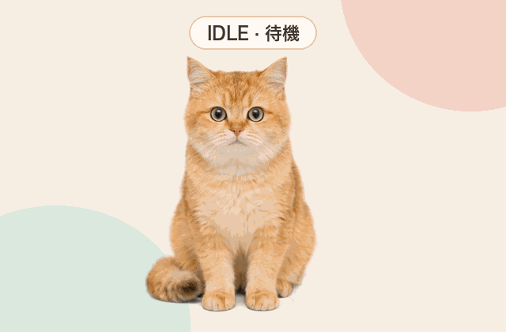
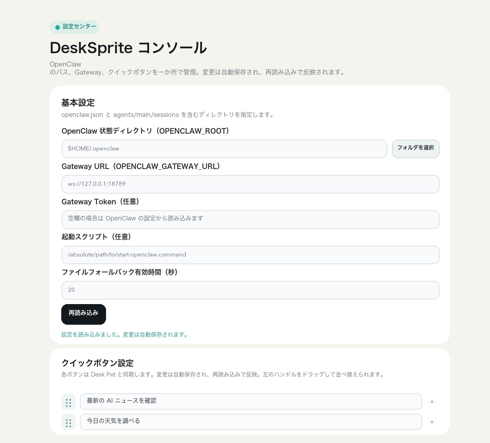
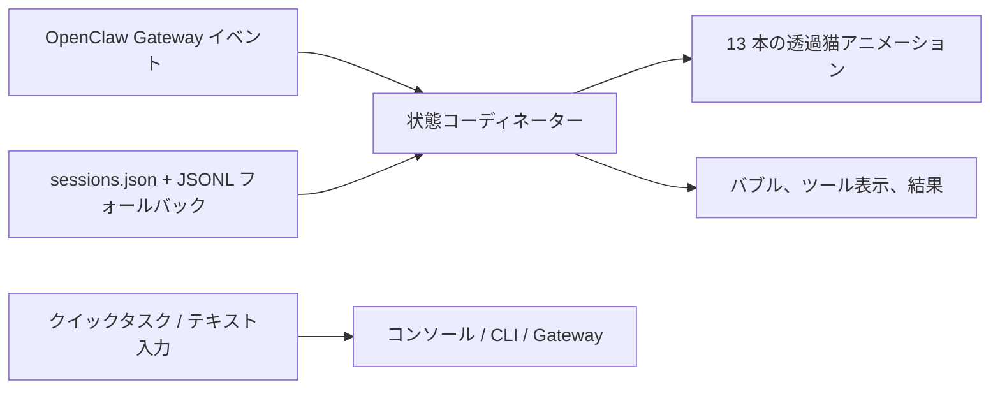

<div align="center">


# 🐈 OpenClaw Desk Pet

<p>
  <a href="README.en.md">English</a> ·
  <a href="README.md">简体中文</a> ·
  <strong>日本語</strong>
</p>

**AI の作業状況を、デスクトップの猫に。**

OpenClaw がまだ動いているか確認するために、何度もコンソールへ戻るのが面倒でした。今は猫を見れば十分です。座っていれば待機中、立ち上がれば作業開始、スマートフォンを持っていればまだ処理中です。

<p>
  <a href="https://github.com/LeoZhaorx/openclaw-desk-pet/actions/workflows/ci.yml"></a>
  
  
  
  <a href="LICENSE"></a>
</p>

<p>
  <a href="#猫の作業プロセス">🎬 デモ</a> ·
  <a href="#なぜ猫をデスクトップの相棒にしたのか">💡 きっかけ</a> ·
  <a href="#openclaw-と-desk-pet-の連携">🔗 仕組み</a> ·
  <a href="#設定をまとめるローカルコンソール">⚙️ 設定</a> ·
  <a href="#3-分で始める">🚀 始める</a>
</p>

</div>


<table>
  <tr>
    <td width="33%" align="center">
      <strong>👀 状態が見える</strong><br><br>
      思考、ツール実行、完了、休止をそれぞれ違う動きで表します。
    </td>
    <td width="33%" align="center">
      <strong>🚀 デスクトップから依頼</strong><br><br>
      クイックタスクを選ぶか、その場で文章を入力できます。
    </td>
    <td width="33%" align="center">
      <strong>⚙️ 設定を一か所で管理</strong><br><br>
      OpenClaw のパス、Gateway、クイックボタンをまとめて編集できます。
    </td>
  </tr>
</table>

## なぜ猫をデスクトップの相棒にしたのか

<table>
  <tr>
    <td width="44%" align="center">
      <br>
      <sub>実際の写真です。公開前に位置情報、端末情報、撮影日時を削除しています。</sub>
    </td>
    <td width="56%" valign="middle">
      <strong>もともと、仕事中にそばへ来る猫だからです。</strong><br><br>
      作業をしていると、家の猫がよくコンピューターの横へ上がってきます。画面を眺めたり、そのまま横で寝たりします。何のタスクを実行しているかは分からなくても、「そばに猫がいる」という感覚はとても具体的です。<br><br>
      OpenClaw Desk Pet に残したかったのも、その距離感でした。話さなくても、別のウィンドウを占有しなくても、ひと目でバックグラウンドの作業状況が分かります。
    </td>
  </tr>
</table>

---

## OpenClaw と Desk Pet の連携


**Agent の処理を行うのは OpenClaw、進行状況を見える形にするのが Desk Pet です。** Gateway のイベントが猫の動き、ツール表示、結果バブルを動かします。デスクトップで選んだクイックタスクや入力した文章は、OpenClaw へ戻して実行されます。

Desk Pet 自体がメール、天気、ブラウザーなどの能力を追加するわけではありません。利用できる機能は、ユーザー自身の OpenClaw 設定とツールに依存します。

## 猫の作業プロセス

このプレビューはアプリに同梱されている実際の透過アニメーションを使用し、表示ラベルだけを日本語にしています。

<div align="center">
  
</div>

ランダム再生ではありません。Desk Pet は OpenClaw Gateway のイベントを受け取り、思考、タスク開始、ツール実行、完了、長時間の待機を状態マシンへ反映します。

## 猫の動きから分かること

| OpenClaw の状態 | Desk Pet の動き | 分かること |
| --- | --- | --- |
| 待機 | 座る、横になる、クイックタスクを表示 | 新しいタスクを開始できる |
| 思考・待ち行列 | 思考バブルと集中モーション | 依頼を受信している |
| タスク開始 | 静止状態から作業モーションへ自然に移行 | OpenClaw が処理を始めた |
| ツール実行 | `exec`、`web`、`sessions_spawn` などを表示 | どの種類の操作を実行しているか |
| 完了 | 最終応答を分割した結果バブルで表示 | コンソールを開かずに結論を確認できる |
| 長時間の待機 | 浅い眠りから深い眠りへ移行 | バックグラウンドが静かな状態 |

## 設定をまとめるローカルコンソール



<table>
  <tr>
    <td width="50%">
      <strong>接続設定</strong><br>
      OpenClaw ディレクトリと Gateway URL を指定します。Token は任意で、ローカルの OpenClaw 設定から自動検出できます。
    </td>
    <td width="50%">
      <strong>起動とフォールバック</strong><br>
      任意の起動スクリプトと、ファイルフォールバックの有効時間を設定できます。
    </td>
  </tr>
  <tr>
    <td width="50%">
      <strong>クイックボタン</strong><br>
      よく使う依頼文を編集し、Desk Pet に表示する順番へドラッグできます。
    </td>
    <td width="50%">
      <strong>自動保存</strong><br>
      変更はローカルに保存されます。「再読み込み」で最新設定を反映します。
    </td>
  </tr>
</table>

コンソールは標準で `127.0.0.1:17890` だけをリッスンします。画像では `$HOME/.openclaw` を使用しており、個人パス、Token、非公開設定は含まれていません。

## 向いている場面

- **コーディングや調査**：複数ステップの Agent 処理を、ログへ何度も戻らず確認できます。
- **日常の自動化**：自分のメール整理、日報、ニュース、天気などの依頼をクイックタスクから送れます。
- **長いタスクとサブ Agent**：ツール名と `sessions_spawn` の表示から進行状況を読み取れます。
- **複数 Space の作業**：透過ウィンドウを macOS の Space 間で常駐させ、位置も記憶します。
- **仕事をする猫が欲しいとき**：待機し、働き、スマートフォンを見て、結果を伝え、最後は眠ります。

## 見た目だけではない仕組み

### 1. 実際の状態で動く

Gateway の `chat` / `agent` イベントを `idle`、`thinking`、`taskStarting`、`tooling`、`completed`、`sleeping` に正規化し、状態マシンでアニメーションを選びます。

### 2. 安全な境界でアニメーションを切り替える

13 本の透過 ProRes クリップは開始、ループ、終了に分かれています。状態が変わっても安全なクリップ境界を待つため、待機、作業、浅い眠り、深い眠りが自然につながります。

### 3. Gateway が一時的に静かでも状態を失わない

リアルタイムイベントが使えない場合は、`sessions.json` と最近の JSONL セッション末尾へフォールバックします。読み取り量を制限し、履歴全体を繰り返し走査しません。

### 4. デスクトップがタスク入力にもなる

クイックタスクは自動切り替え、ホイール選択、クリック送信に対応します。テキスト入力は、開いている OpenClaw コンソール、OpenClaw CLI、Gateway WebSocket の順に送信を試みます。

### 5. 設定専用のコンソールがある

OpenClaw のパス、Gateway、起動方法、フォールバック時間、クイックタスクを、環境ファイルを何度も開かずに編集できます。

## 実行構成



- **デスクトップアプリ**：SwiftUI + AppKit + AVFoundation
- **ローカル設定パネル**：Python 標準ライブラリの HTTP サーバー。`127.0.0.1` のみ
- **状態ソース**：OpenClaw Gateway protocol v3 とローカルセッションファイルのフォールバック
- **ウィンドウ**：透過、枠なし、ドラッグ可能、Space 間に常駐、位置を記憶

詳細なデータフローと信頼境界は [Architecture](docs/ARCHITECTURE.md) を参照してください。

## 3 分で始める

### 必要なもの

- macOS 13 以降
- Xcode Command Line Tools に含まれる Swift 5.9 以降
- Python 3.9 以降
- インストールと設定が完了した [OpenClaw](https://docs.openclaw.ai/)

確認済み環境：macOS 15.7.4、Swift 6.2.4、Python 3.9.6、OpenClaw 2026.6.11。

### インストール

```bash
git clone https://github.com/LeoZhaorx/openclaw-desk-pet.git
cd openclaw-desk-pet
cp desk-sprite/.desk-sprite.env.example desk-sprite/.desk-sprite.env
chmod 600 desk-sprite/.desk-sprite.env
```

`desk-sprite/.desk-sprite.env` を編集し、少なくとも次を確認します。

```bash
OPENCLAW_ROOT="$HOME/.openclaw"
```

起動：

```bash
./start-desk-pet.command
```

ローカル設定コンソールは [http://127.0.0.1:17890/](http://127.0.0.1:17890/) で開きます。設定を変更したら「再読み込み」を押します。

```bash
./stop-desk-pet.command
./restart-desk-pet.command
```

`desk-sprite/` から `./launch.sh`、`./halt.sh`、`./health.sh` を直接実行することもできます。

<details>
<summary><strong>設定変数</strong></summary>

| 変数 | 既定値 | 用途 |
| --- | --- | --- |
| `OPENCLAW_ROOT` | `$HOME/.openclaw` | OpenClaw の状態、設定、セッション |
| `OPENCLAW_GATEWAY_URL` | `ws://127.0.0.1:18789` | Gateway WebSocket URL |
| `OPENCLAW_GATEWAY_TOKEN` | 自動検出 | 任意の Token。Git へコミットしないでください |
| `OPENCLAW_ACTIVE_WINDOW_SECONDS` | `20` | ファイルフォールバックのアクティブ時間 |
| `OPENCLAW_START_SCRIPT` | 空 | 任意の絶対起動スクリプト。空の場合は `openclaw gateway start` |
| `DESK_SPRITE_CONSOLE_PORT` | `17890` | ローカル設定コンソールのポート |
| `DESK_SPRITE_ASSETS` | リポジトリの `media/` | アニメーション素材ディレクトリ |

Token の検出順は、明示的な環境変数、OpenClaw 設定内の Gateway Token、OpenClaw の `.env` です。ローカル値は Git で無視される `desk-sprite/.desk-sprite.env` のみに保存してください。

</details>

<details>
<summary><strong>開発と検証</strong></summary>

```bash
swift build --package-path desk-sprite
python3 -m unittest discover -s desk-sprite/tests -v
python3 -m py_compile desk-sprite/console_server.py scripts/check_release.py scripts/generate_readme_locales.py
bash -n desk-sprite/*.sh
zsh -n start-desk-pet.command restart-desk-pet.command stop-desk-pet.command
python3 scripts/check_release.py
```

GitHub Actions は Swift ビルド、Python テスト、シェル構文、公開ファイルを検証します。コントリビュート前に [CONTRIBUTING.md](CONTRIBUTING.md) を確認してください。

</details>

## プライバシーとセキュリティ

- 設定コンソールは `127.0.0.1` のみにバインドし、Host、Origin、リクエストサイズを検証します。公開ネットワークへ出さないでください。
- `.desk-sprite.env`、Token、ログ、PID、ビルドキャッシュ、アーカイブ、原寸メディアのバックアップは Git の対象外です。
- アプリは OpenClaw のセッションを読み取り、イベント監視とタスク送信のため Gateway operator 権限を要求します。
- 開いている OpenClaw Web コンソールへタスクを同期する際、Chrome / Safari の AppleScript 自動操作権限を求めることがあります。

[Security Policy](SECURITY.md) と [セキュリティ監査](docs/SECURITY_AUDIT.md) を参照してください。

## リポジトリサイズ

`media/` には実行時に必要な透過 ProRes アニメーションが含まれ、現在約 378 MB です。各ファイルは GitHub の 100 MiB 制限未満ですが、`idle-core.mov` は大容量ファイル警告の対象です。頻繁に更新する場合は Git LFS または GitHub Releases への移行を推奨します。

## ライセンス

ソースコードとリポジトリで公開するビジュアル素材は [MIT License](LICENSE) です。新しい素材を追加する前に、同じ条件で再配布できる権利を確認してください。

このプロジェクトには OpenClaw が必要です。コミュニティによる連携プロジェクトであり、OpenClaw 公式の承認を受けたものではありません。
