<div align="center">

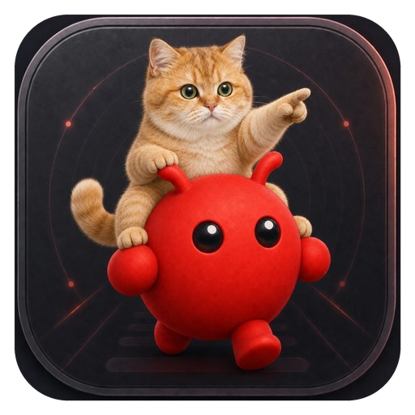

# 🐈 OpenClaw Desk Pet

<p>
  <a href="README.md">English</a> ·
  <strong>简体中文</strong> ·
  <a href="README.ja.md">日本語</a>
</p>

**把 AI 的工作状态，养成桌面上的猫。**

做这个桌宠的原因很简单：我不想为了确认 OpenClaw 还在不在干活，一遍遍切回控制台。现在瞄一眼猫就行——坐着是空闲，起身是开工，抱着手机就是还在忙。

<p>
  <a href="https://github.com/LeoZhaorx/openclaw-desk-pet/actions/workflows/ci.yml"></a>
  
  
  
  <a href="LICENSE"></a>
</p>

<p>
  <a href="#桌宠的工作过程">🎬 先看演示</a> ·
  <a href="#为什么用了一只猫作为你的桌面伙伴">💡 灵感</a> ·
  <a href="#openclaw-和桌宠怎么配合">🔗 看懂关系</a> ·
  <a href="#配置不用手改控制台统一管理">⚙️ 配置台</a> ·
  <a href="#3-分钟开始使用">🚀 开始使用</a>
</p>

</div>

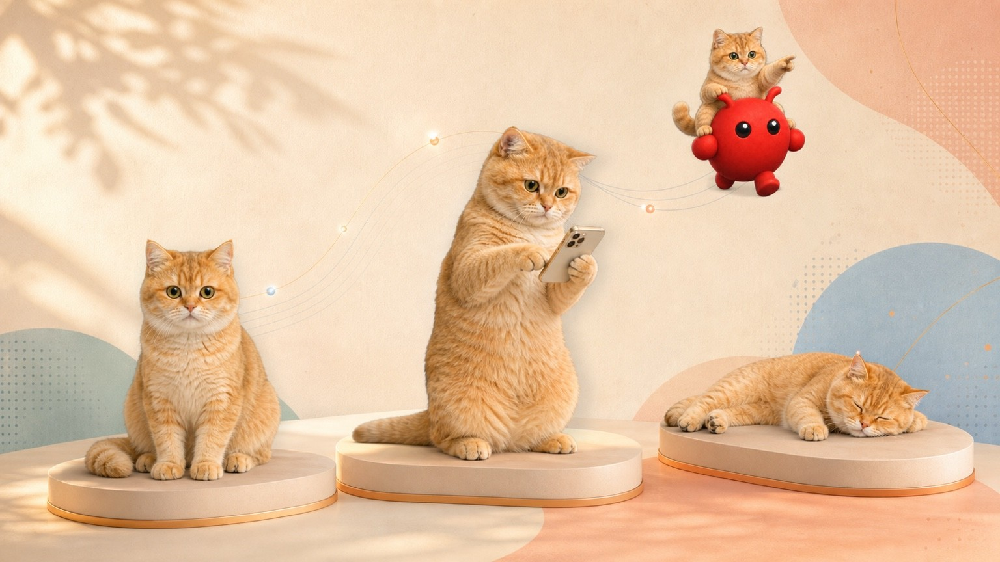

<table>
  <tr>
    <td width="33%" align="center">
      <strong>👀 看见状态</strong><br><br>
      思考、工具调用、完成与休眠，都有对应动作。
    </td>
    <td width="33%" align="center">
      <strong>🚀 从桌面下任务</strong><br><br>
      点快捷任务，或者直接输入一句话。
    </td>
    <td width="33%" align="center">
      <strong>⚙️ 配置集中管理</strong><br><br>
      OpenClaw 路径、Gateway 与快捷按钮放在一个页面。
    </td>
  </tr>
</table>

## 为什么用了一只猫作为你的桌面伙伴？

<table>
  <tr>
    <td width="44%" align="center">
      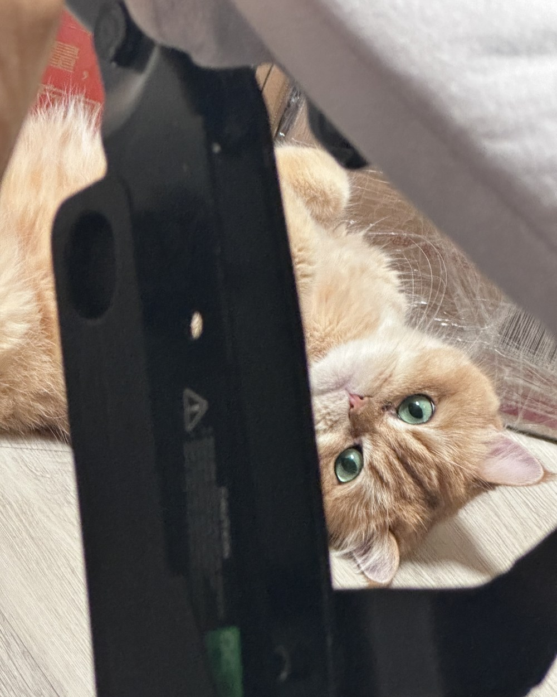<br>
      <sub>真实照片；开源版本已清除拍摄元数据。</sub>
    </td>
    <td width="56%" valign="middle">
      <strong>因为它本来就会来陪我工作。</strong><br><br>
      我工作的时候，家里的猫经常爬到电脑旁边。有时盯着屏幕，有时干脆靠着电脑躺下。它当然不知道我在跑什么任务，但那种“旁边一直有只猫”的感觉很具体。<br><br>
      做 OpenClaw Desk Pet 时，我想保留的就是这种陪伴：它不用说话，也不必占一个窗口；抬头看一眼，就知道后台还在不在忙。
    </td>
  </tr>
</table>

---

## OpenClaw 和桌宠怎么配合？

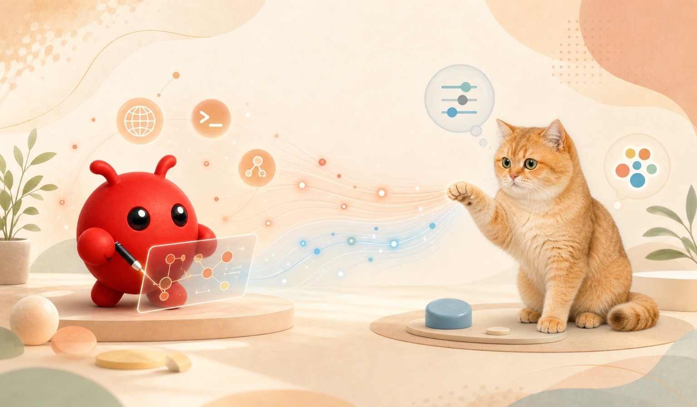

**OpenClaw 负责真正的 Agent 工作，Desk Pet 负责把过程变得可见。** Gateway 把状态事件送给桌宠；你在桌面点快捷任务或输入文字时，请求再交回 OpenClaw 执行。

Desk Pet 不替代 OpenClaw，也不会凭空多出邮件、天气或浏览器能力。它是 OpenClaw 的桌面状态层、轻量任务入口和结果提示器。

## 桌宠的工作过程

从桌面快捷任务开始，到 OpenClaw 思考、调用工具、创建子任务，再把结果送回气泡：

<div align="center">
  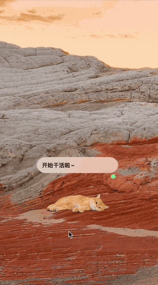
</div>

这不是预设好的剧情。桌宠会监听 OpenClaw Gateway 的实时事件，并把 `thinking`、工具调用、完成和休眠状态映射成对应动画。

> 演示里的“检查邮件”“查询天气”是发送给 OpenClaw 的真实任务示例，不是桌宠内置的邮件或天气服务。它能做什么，取决于你的 OpenClaw 配置与工具能力。

## 它会怎么陪你工作

<table>
  <tr>
    <td width="50%" align="center">
      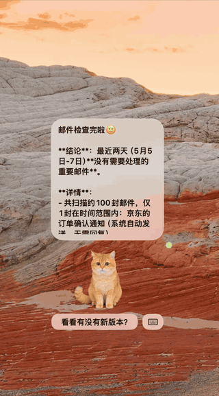<br>
      <strong>想到什么，直接问</strong><br>
      用快捷任务，也可以切到键盘输入。
    </td>
    <td width="50%" align="center">
      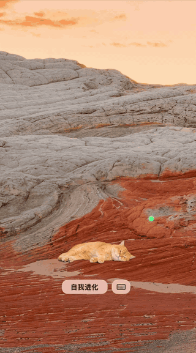<br>
      <strong>没事做，就认真睡觉</strong><br>
      从浅睡到深睡，不是永远循环同一个动作。
    </td>
  </tr>
</table>

## 你能从猫的状态里读到什么

<div align="center">
  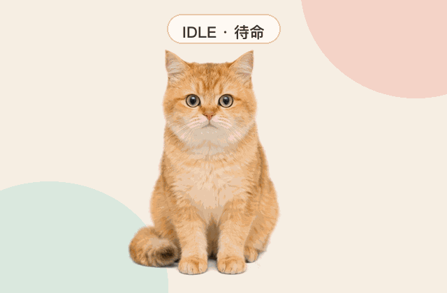
</div>

| OpenClaw 正在做什么 | 桌宠会怎么表现 | 你不用再猜什么 |
| --- | --- | --- |
| 等待任务 | 坐着、趴着，展示可切换的快捷任务 | 现在可以开始新任务 |
| 思考与排队 | 思考气泡、专注动画 | 请求已经收到，不是卡住了 |
| 启动任务 | 从静止自然切到工作动画 | OpenClaw 已经开工 |
| 调用工具 | 显示 `exec`、`web`、`sessions_spawn` 等标签 | 当前跑到了哪类操作 |
| 返回结果 | 气泡分段展示最终回复 | 不切回控制台也能先看结论 |
| 长时间空闲 | 浅睡，再进入深睡循环 | 后台现在很安静 |

## 四个真实瞬间

<table>
  <tr>
    <td width="50%" align="center">
      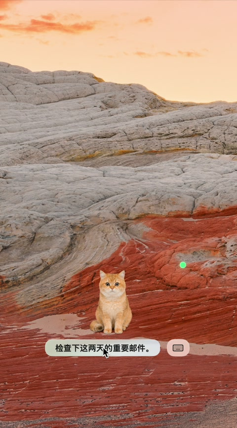<br>
      <strong>快捷任务</strong><br>
      悬停后滚动切换，点一下就发送。
    </td>
    <td width="50%" align="center">
      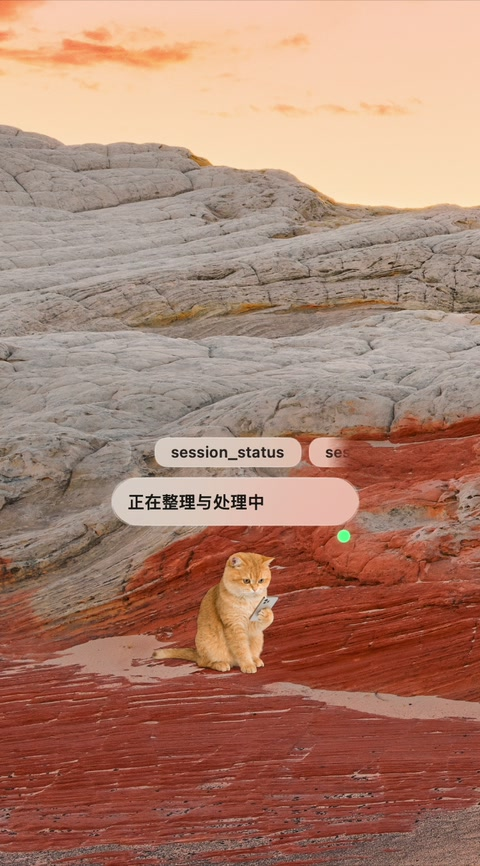<br>
      <strong>工具调用可见</strong><br>
      气泡会显示正在执行的工具与阶段。
    </td>
  </tr>
  <tr>
    <td width="50%" align="center">
      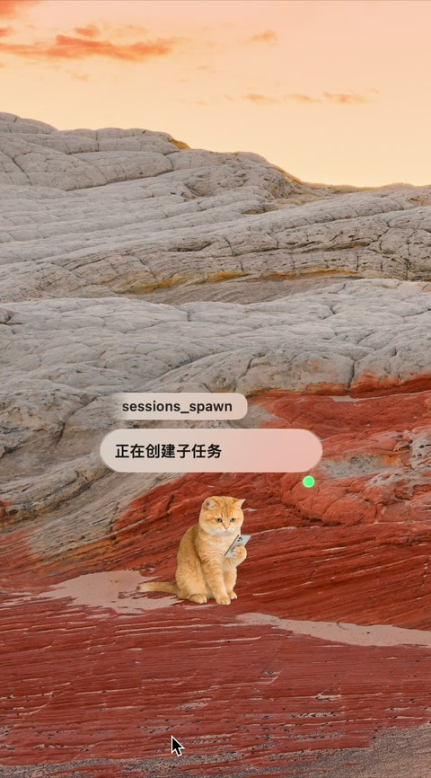<br>
      <strong>子任务也看得见</strong><br>
      `sessions_spawn` 出现时，猫正在创建子任务。
    </td>
    <td width="50%" align="center">
      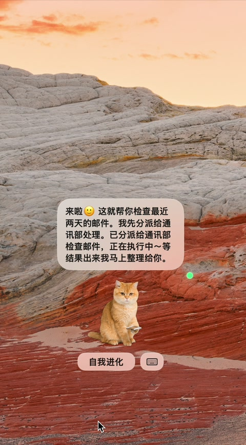<br>
      <strong>结果送到桌面</strong><br>
      最终回复会清理控制标记后分段展示。
    </td>
  </tr>
</table>

## 配置不用手改：控制台统一管理

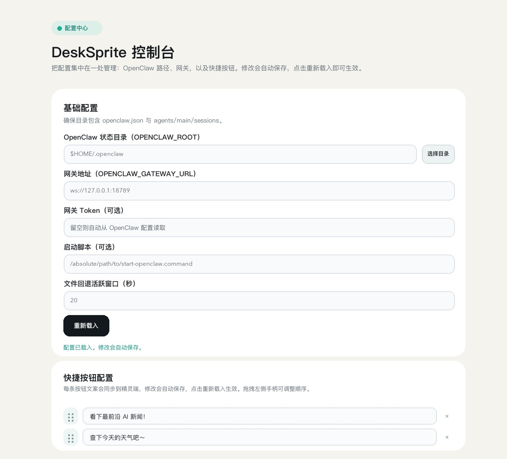

<table>
  <tr>
    <td width="50%">
      <strong>基础连接</strong><br>
      选择 OpenClaw 目录，设置 Gateway 地址；Token 可以留空，由应用从本机 OpenClaw 配置自动发现。
    </td>
    <td width="50%">
      <strong>启动与回退</strong><br>
      可指定启动脚本，并调整文件回退模式的活跃时间窗口。
    </td>
  </tr>
  <tr>
    <td width="50%">
      <strong>快捷按钮</strong><br>
      直接修改常用任务文案，拖动排序；桌宠会同步读取新的按钮列表。
    </td>
    <td width="50%">
      <strong>自动保存</strong><br>
      修改会自动写入本地配置，点击“重新载入”即可让桌宠应用新设置。
    </td>
  </tr>
</table>

配置台默认只监听 `127.0.0.1:17890`。上图已把个人工作目录替换为 `$HOME/.openclaw`；仓库不包含本机路径、Token 或其他私密配置。

## 适合这些场景

- **写代码、整理资料**：Agent 在后台跑多步任务时，不用频繁切回日志确认进度。
- **日常自动化**：把常用指令做成快捷任务，邮件整理、日报、天气查询都可以从桌面发起。
- **长任务与子 Agent**：工具标签和子任务状态会直接显示，知道它是在工作还是在等待。
- **多桌面工作流**：透明窗口可跨 Space 常驻，位置会自动记住。
- **单纯想要一只会工作的猫**：它会发呆、开工、看手机、给结果，也会从浅睡睡到深睡。

## 好玩的地方，不止是换了一套皮肤

### 1. 动画跟着真实状态走

Gateway 的 `chat` / `agent` 事件会先被归一化成 `idle`、`thinking`、`taskStarting`、`tooling`、`completed`、`sleeping`。猫的动作来自这套状态机，不是随机播放。

### 2. 切动作不会突然抽一下

13 段透明 ProRes 动画分成进入、循环和退出片段。状态变化会等到安全的片段边界再切换，所以从趴着到开工、从浅睡到深睡都更自然。

### 3. Gateway 暂时没消息，也不至于失明

实时事件不可用时，应用会回退读取 `sessions.json` 和最近会话 JSONL 的尾部，继续判断当前状态。每次只检查有限大小的数据，不会反复扫描整段历史。

### 4. 桌面就是任务入口

快捷任务支持自动轮播、滚轮切换和点击发送；也可以直接输入文字。消息会依次尝试已打开的 OpenClaw 控制台、OpenClaw CLI 和 Gateway WebSocket。

### 5. 配置也有自己的控制台

不用反复打开环境文件。OpenClaw 路径、Gateway、启动脚本、回退窗口和快捷任务都可以在本地页面集中修改，自动保存后重新载入即可生效。

## 运行方式

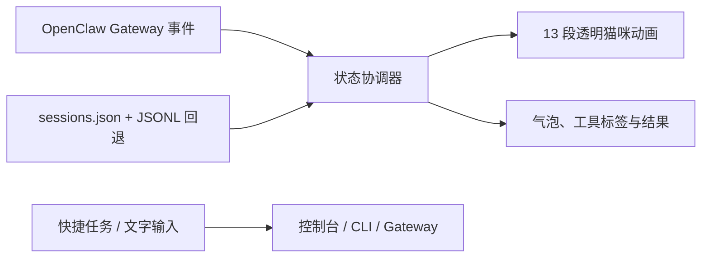

- **桌面端**：SwiftUI + AppKit + AVFoundation
- **本地配置面板**：Python 标准库 HTTP 服务，只监听 `127.0.0.1`
- **状态来源**：OpenClaw Gateway protocol v3，外加本地会话文件回退
- **窗口行为**：透明无边框、跨 Space、可拖动、记住位置

更完整的数据流与信任边界见 [架构说明](docs/ARCHITECTURE.md)。

## 3 分钟开始使用

### 需要准备

- macOS 13 或更高版本
- Swift 5.9 或更高版本（安装 Xcode Command Line Tools 即可）
- Python 3.9 或更高版本
- 已安装并配置 [OpenClaw](https://docs.openclaw.ai/)

当前验证环境：macOS 15.7.4、Swift 6.2.4、Python 3.9.6、OpenClaw 2026.6.11。

### 安装

```bash
git clone https://github.com/LeoZhaorx/openclaw-desk-pet.git
cd openclaw-desk-pet
cp desk-sprite/.desk-sprite.env.example desk-sprite/.desk-sprite.env
chmod 600 desk-sprite/.desk-sprite.env
```

编辑 `desk-sprite/.desk-sprite.env`，至少确认：

```bash
OPENCLAW_ROOT="$HOME/.openclaw"
```

然后启动：

```bash
./start-desk-pet.command
```

本地配置面板默认位于 [http://127.0.0.1:17890/](http://127.0.0.1:17890/)。修改配置后点击“重新载入”。

```bash
./stop-desk-pet.command
./restart-desk-pet.command
```

也可以进入 `desk-sprite/` 使用 `./launch.sh`、`./halt.sh` 和 `./health.sh`。

<details>
<summary><strong>配置项</strong></summary>

| 变量 | 默认值 | 用途 |
| --- | --- | --- |
| `OPENCLAW_ROOT` | `$HOME/.openclaw` | OpenClaw 状态、配置与会话目录 |
| `OPENCLAW_GATEWAY_URL` | `ws://127.0.0.1:18789` | Gateway WebSocket 地址 |
| `OPENCLAW_GATEWAY_TOKEN` | 自动发现 | 可选 Gateway Token；不要提交到 Git |
| `OPENCLAW_ACTIVE_WINDOW_SECONDS` | `20` | 文件回退模式的活跃窗口 |
| `OPENCLAW_START_SCRIPT` | 空 | 可选的绝对启动脚本；为空时运行 `openclaw gateway start` |
| `DESK_SPRITE_CONSOLE_PORT` | `17890` | 本地配置面板端口 |
| `DESK_SPRITE_ASSETS` | 仓库 `media/` | 动画素材目录 |

Token 的发现顺序为：显式环境变量、OpenClaw 配置中的 Gateway Token、OpenClaw `.env` 文件。本机值只应保存在已被 Git 忽略的 `desk-sprite/.desk-sprite.env`。

</details>

<details>
<summary><strong>开发与验证</strong></summary>

```bash
swift build --package-path desk-sprite
python3 -m unittest discover -s desk-sprite/tests -v
python3 -m py_compile desk-sprite/console_server.py scripts/check_release.py scripts/generate_readme_locales.py
bash -n desk-sprite/*.sh
python3 scripts/check_release.py
```

项目使用 GitHub Actions 验证 Swift 构建、Python 测试、脚本语法和发布文件。贡献前请阅读 [CONTRIBUTING.md](CONTRIBUTING.md)。

</details>

## 隐私与安全

- 配置面板只监听 `127.0.0.1`，并校验 Host、Origin 与请求体；不要把它改成公网服务。
- `.desk-sprite.env`、Token、日志、PID、构建缓存和原尺寸素材副本都不会进入 Git。
- 应用会读取 OpenClaw 会话记录，并请求 Gateway 的 operator 权限来观察事件和发送任务。
- 为把任务同步到已打开的 OpenClaw 网页，应用可能请求 Chrome / Safari 的 AppleScript 自动化权限。

安全设计见 [Security Policy](SECURITY.md) 与 [安全审计记录](docs/SECURITY_AUDIT.md)。

## 仓库体积说明

`media/` 包含运行时需要的透明 ProRes 动画，当前约 378 MB。单文件均低于 GitHub 100 MiB 硬限制；`idle-core.mov` 会触发 GitHub 的大文件提示。若以后频繁更新动画，建议把素材迁移到 Git LFS 或 GitHub Releases，避免历史持续膨胀。

## 许可证

源码与仓库内发布的视觉素材采用 [MIT License](LICENSE)。提交新素材前，请确认你有权按该许可证再分发。

如果它让你的 OpenClaw 更容易被“看见”，欢迎点个 Star，也欢迎带着录屏或截图来提 PR。
