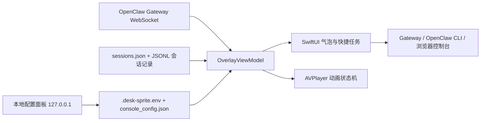

# 架构说明

## 总览

OpenClaw Desk Pet 由一个 Swift/AppKit 桌面进程和一个 Python 本地配置服务组成。桌面进程是运行时核心；Python 服务只负责编辑本机配置、快捷任务和触发重载。

## 运行时组件

### `AppConfig`

解析素材路径、OpenClaw 状态目录、Gateway URL、Token、活动窗口和可选启动脚本。Token 可以来自当前进程环境、OpenClaw 配置或 OpenClaw dotenv 文件；Token 只在内存中用于 Gateway 认证和 CLI 子进程环境。

### `OverlayViewModel`

每秒执行一次状态协调：

1. 维护 Gateway WebSocket、心跳和重连。
2. 解析 `chat` 与 `agent` 事件，跟踪运行、工具调用和子任务。
3. 同步读取 `agents/main/sessions/sessions.json` 以及最近会话 JSONL，作为 Gateway 事件缺失时的回退。
4. 将两路信号归一化为 `idle`、`thinking`、`taskStarting`、`tooling`、`completed`、`sleeping`。
5. 生成气泡文本、工具标签和快捷任务可见状态。

文件回退只读取会话文件尾部最多 256KiB，避免每秒扫描完整历史。

### 消息发送

快捷任务按以下顺序发送：

1. 尝试通过 AppleScript 调用已经打开的本地 OpenClaw 控制台。
2. 尝试 `openclaw gateway call chat.send`。
3. 如果 Gateway WebSocket 已连接，则直接发送 `chat.send` 请求；否则排队等待重连。

消息和会话键作为结构化参数传递。CLI 路径使用 `Process.arguments`，不经过 shell 拼接。

### `SpriteVideoPlayerView`

AVPlayer 状态机将统一状态映射到 13 个透明 ProRes 片段：

- 启动：`intro-seed` → `idle-core`
- 思考：`focus-loop`
- 工作：`work-in` → `work-loop` → `work-out`
- 休眠：`nap-in` → `nap-loop` → `nap-to-deep` → `deep-loop`
- 唤醒：`deep-to-nap`、`deep-out` 或 `nap-out`

进入和退出片段在播放期间会锁定切换；新状态被延迟到安全的片段边界，以避免抖动和突跳。

### 桌面窗口

`FloatingWindow` 是无边框、透明、跨 Space 的 AppKit 面板，SwiftUI 负责内容布局。窗口位置保存到 `UserDefaults`，并在显示器布局变化后夹紧到可见区域。

## 本地配置服务

`console_server.py` 使用 Python 标准库 `ThreadingHTTPServer`：

- 仅监听 `127.0.0.1`。
- 校验 Host、Origin 和 `Sec-Fetch-Site`，降低 DNS rebinding 与浏览器跨站请求风险。
- API 请求体限制为 64KiB，只接受 JSON 配置。
- 配置值禁止换行/NUL，Gateway URL 只允许 `ws://` 或 `wss://`。
- `.desk-sprite.env` 写入权限固定为 `0600`。
- 启动脚本把 env 文件作为数据解析，只导出允许的变量，不执行文件内容。

## 信任边界

- Gateway 与本地会话记录属于受信任的本机 OpenClaw 数据，但显示前仍会清理控制标记。
- 配置面板是本机管理界面，不应暴露到 LAN、反向代理或公网。
- `OPENCLAW_START_SCRIPT` 是用户明确授权执行的本机脚本；必须是绝对路径。
- 动画和控制台图片是仓库分发资产，不从网络动态加载。
